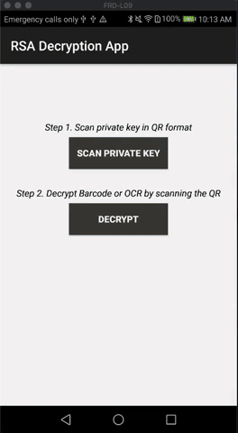

# RSA Decryption for Barcode and Text Recognition
The RSA Decryption app demonstrates how to use RSA decryption in order to decrypt RSA-encrypted text in plain or barcode format. The app is structured into two modules or steps:
<ol>
  <li>Scanning of the RSA private key in QR code format</li>
  <li>Scanning of the encrypted text</li>
</ol>

<h2>Libraries</h2>
<ul>
  <li>The app uses <a href="https://github.com/zxing/zxing">ZXing ("Zebra Crossing")</a> barcode scanning library to scan the QR codes. </li>  
  <li>The app uses <a href="https://github.com/firebase/quickstart-android/blob/master/mlkit/README.md">MLKit Vision</a> API for live camera analysis to detect barcodes and text. </li>
</ul>

<h2>Use</h2>
<ol>
  <li>Download the repository and open it with Android Studio.</li>
  <li>In the app-level build.gradle change the name of the app from "com.example.mlkit_barcode_ocr" to your desired name.</li>
  <li>Register the app with <a href="https://firebase.google.com/docs/android/setup">Firebase</a>, download the .json file and add it in the <b>app folder</b>. 
</ol> 

It is recommended that you deploy the app on an Android device, because of the scanning capabilities that are easier to use on a phone. However, if you want to use the Android emulator, you can make the most of the app by changing the camera settings of the emulator to the computer's webcam. Under Tools > AVD Manager, select the "pencil" to get to "Virtual Device Configuration". Show Advanced Settings > Camera will give you the option of using emulated, webcam0 or none. Select Webcam0 for the Front camera.

Press run. The rest of the instructions are shown on the screen.
. 

As a first stem, you will have to scan the private key in QR format. Some examples can be found under Tests/.

<h2>Barcode Detection</h2>

<h2>Text Detection</h2>

